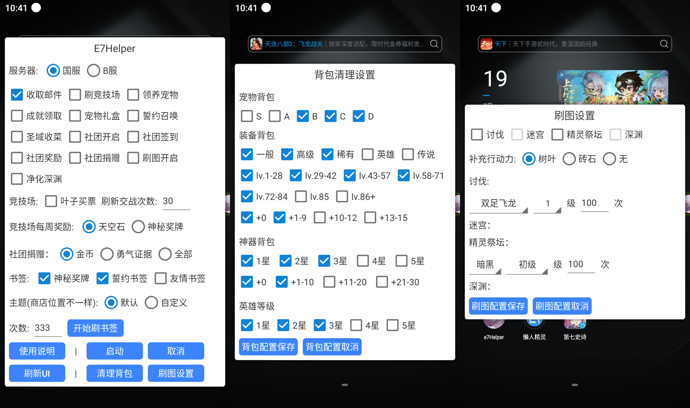
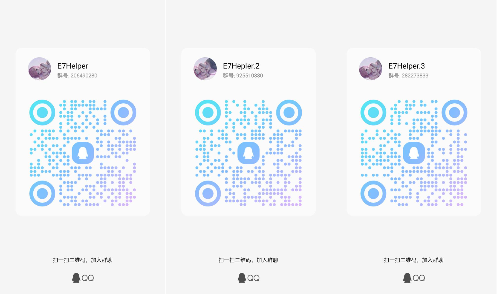

<div align="center">
<h1>E7Helper(<a href="https://discord.com/invite/MqJe64QHgK">Join Discord</a>)</h1>
</div>

<div>
<p>一款多功能覆盖的第七史诗脚本助手</a> </p>
<p style="color: red;">1、有能力可自行修改运行打包，闭源版本已收费！！！</p>
<p style="color: red;">2、此仓库后续不再推送代码，软件由root端转换到无障碍。会发送apk文件到仓库中</p>
<p style="color: red;">3、QQ群可能满了，看群介绍有其他群可以加!!</p>
<a style="color: greenyellow" href=https://www.yuque.com/u28780164/yv3kgg/rey0agsxfl55iool?singleDoc/>使用文档(必读)　</a> |
<a style="color: deepskyblue" href=https://g.nga.cn/read.php?tid=37578061&rand=743/>国服反和谐(教程)</a> | 
<a style="color: mediumvioletred" href=https://www.bilibili.com/video/BV1214y1k7XB/?spm_id_from=333.337.search-card.all.click&vd_source=0a11f3e57dadf1233d83ab558c971e40/>第七史诗配装器　</a>| 
<a href=https://qm.qq.com/cgi-bin/qm/qr?k=o6MW-K-Ws6A2-S_WhHEro1JggzREWPzt&jump_from=webapi&authKey=PRSHw0kOjKtnqEVwyXCRHnKKwAWhzXWD/y486deoyZ/AWyNfGLwHIEwjb8gf9yoX>qq交流群:206490280 </a> | 
<a href="https://github.com/boluokk/e7QQBot">QQ消息提示项目地址</a>
</div>

<h1></h1>

### 开源免费版截图(不在维护)

<p></p>

### 闭源收费版截图(持续维护中..)
#### 最近更新：
```
1、添加月塔、派遣任务、木降临活动。
2、修复已知问题，悬浮窗消失问题。
3、优化启动加载ui速度。
```
<p></p>
<p></p>
<p></p>
<p></p>
<p></p>
<p></p>
<p></p>
<p></p>
<p></p>
<p></p>
<p></p>
<p></p>
<p></p>
<p></p>
<p></p>
<p></p>
<p></p>
<p></p>
<p></p>
<p></p>
<p></p>
<p></p>
<p></p>
<p></p>


### 部分功能视频
<div align="center">
    
    
</div>

### 交流群
<div align="center">
    
</div>

### 开发

1、下载懒人精灵IDE(3.8.6.2)

2、编码调试

```python
1、将整个项目
clone
下来
2、填写
start.py
中的
projectPath
和
packagePath
3、运行
copy()
函数
4、开始编码调试
```

3、发布

```python
1、在懒人IDE中打包脚本文件
2、运行
start.py
中的
saveAndPush()
函数
```
